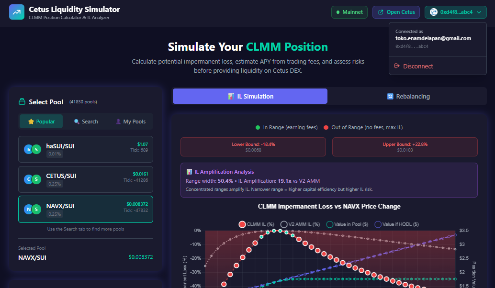
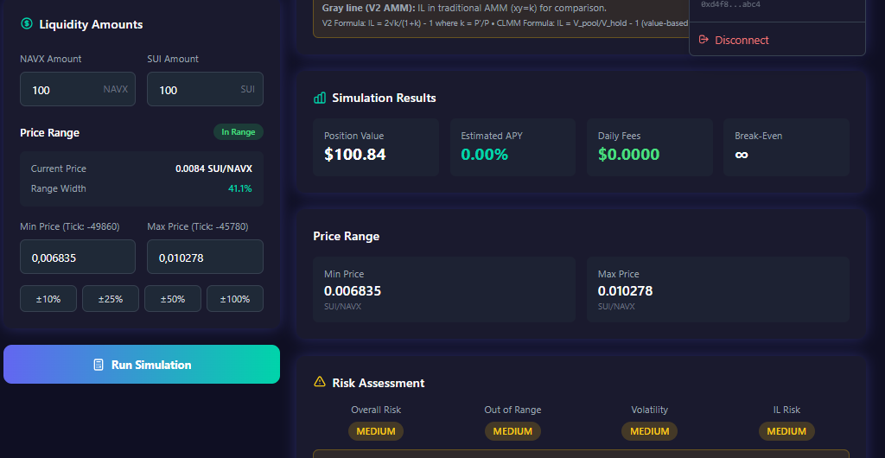
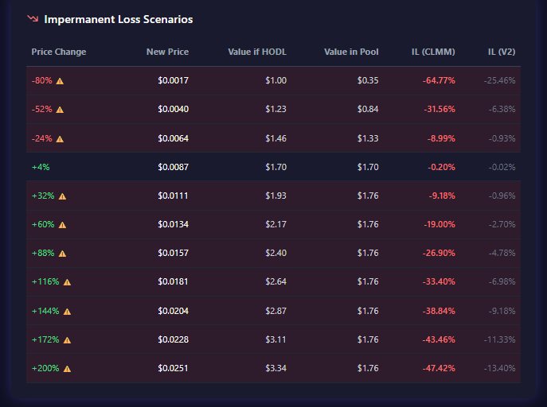

# 🌊 Cetus Liquidity Simulator

<div align="center">


**A professional liquidity simulation tool for Cetus DEX on Sui blockchain**

[🚀 Live Demo](https://cetusl-liqsim.vercel.app/) · [Report Bug](https://github.com/muhammadtakdir/cetusl_liqsim/issues) · [Request Feature](https://github.com/muhammadtakdir/cetusl_liqsim/issues)

</div>

---

## 📖 Overview

**Cetus Liquidity Simulator** helps DeFi users understand and simulate liquidity provision on **Concentrated Liquidity Market Maker (CLMM)** pools. Before committing real funds, users can:

- 📊 **Simulate** different price scenarios and see potential returns
- ⚠️ **Understand** impermanent loss risks in concentrated liquidity
- 💰 **Calculate** expected APY from trading fees
- 🎯 **Optimize** price range selection for maximum efficiency

---

## 🖼️ Screenshots

<div align="center">

### Main Dashboard
*Select pools and configure your liquidity position*



### Pool Selection & Statistics
*View real-time pool data from Cetus Mainnet*



### Simulation Results
*Analyze IL, APY, and risk assessment*



</div>

---

## ✨ Features

| Feature | Description |
|---------|-------------|
| ⚡ **Instant Loading** | Pools appear immediately with pre-cached data |
| 🔢 **IL Calculator** | Simulate impermanent loss for various price scenarios |
| 📊 **APY Estimation** | Calculate expected returns from trading fees |
| ⚠️ **Risk Assessment** | Evaluate out-of-range and volatility risks |
| 📈 **Interactive Charts** | Visualize IL vs price change with Chart.js |
| 🎯 **Price Range Selection** | Configure tick-based liquidity ranges |
| 🔗 **Real Pool Data** | Connect to Cetus Mainnet via SDK |
| 👛 **zkLogin Wallet** | Connect with Google account (no seed phrase!) |
| 📱 **Mobile Responsive** | Works on all screen sizes |

---

## ⚡ Instant Pool Loading

Unlike typical DeFi apps that require waiting for blockchain data, this simulator uses a **hybrid API + caching strategy** for instant user experience:

```
┌─────────────────────────────────────────────────────────────┐
│                    LOADING STRATEGY                          │
├─────────────────────────────────────────────────────────────┤
│                                                             │
│  User Opens App                                             │
│       │                                                     │
│       ▼                                                     │
│  ┌─────────────────────────────────────────┐                │
│  │  ⚡ PRIORITY 1: Return API cache        │ ◄── 0ms       │
│  │     (if available from previous fetch)  │                │
│  └─────────────────────────────────────────┘                │
│       │                                                     │
│       ▼                                                     │
│  ┌─────────────────────────────────────────┐                │
│  │  🚀 PRIORITY 2: Fetch from Cetus API    │ ◄── ~200ms    │
│  │     api-sui.cetus.zone (server-cached!) │                │
│  └─────────────────────────────────────────┘                │
│       │                                                     │
│       ▼                                                     │
│  ┌─────────────────────────────────────────┐                │
│  │  📦 FALLBACK: Pre-cached static pools   │                │
│  │     + SDK background fetch              │                │
│  └─────────────────────────────────────────┘                │
│                                                             │
└─────────────────────────────────────────────────────────────┘
```

### How It Works

1. **Cetus REST API**: Primary data source from `api-sui.cetus.zone/v2/sui/stats_pools` (same API used by app.cetus.zone)
2. **Server-side Cache**: Cetus API already caches pool data on their server (very fast!)
3. **Client-side Cache**: API responses cached for 2 minutes to minimize requests
4. **SDK Fallback**: If API fails, falls back to SDK (direct blockchain queries)
5. **Static Fallback**: Pre-cached popular pools as last resort

### API Endpoint

```typescript
// Cetus Stats API - Returns pre-cached pool data with real-time prices
const CETUS_API_URL = 'https://api-sui.cetus.zone/v2/sui/stats_pools';

// Parameters:
// - display_all_pools=true  : Include all pools
// - limit=50                : Number of pools to fetch
// Returns: Pool data with TVL, price, APR, volume 24h, etc.
```

### Benefits

| Metric | Before (SDK only) | After (API + Cache) |
|--------|-------------------|---------------------|
| Initial Load | 3-5 seconds | **~200ms** |
| Data Freshness | Real-time | Server-cached (minutes) |
| User Experience | "Loading pools..." | Instant |
| Offline Support | ❌ | ✅ Via client cache |

---

## 🚀 Quick Start

### Prerequisites

- **Node.js 18+** 
- **npm** or **yarn**

### Installation

```bash
# Clone the repository
git clone https://github.com/muhammadtakdir/cetusl_liqsim.git
cd cetusl_liqsim

# Install dependencies
npm install

# Configure environment (optional - for zkLogin)
cp .env.example .env
# Edit .env and add your Google OAuth client ID

# Start development server
npm run dev
```

Open http://localhost:5173 in your browser.

### Build for Production

```bash
npm run build
npm run preview
```

---

## 🏗️ Architecture

```
┌─────────────────────────────────────────────────────────────┐
│                        Frontend (React)                      │
├─────────────────────────────────────────────────────────────┤
│  ┌─────────────┐  ┌─────────────┐  ┌─────────────────────┐  │
│  │   Header    │  │PoolSelector │  │  SimulationResults  │  │
│  │  + Wallet   │  │  + Tabs     │  │  + Charts           │  │
│  └─────────────┘  └─────────────┘  └─────────────────────┘  │
│  ┌─────────────┐  ┌─────────────┐  ┌─────────────────────┐  │
│  │  PoolStats  │  │ LiquidityIn │  │    ILChart          │  │
│  │             │  │    put      │  │    (Chart.js)       │  │
│  └─────────────┘  └─────────────┘  └─────────────────────┘  │
├─────────────────────────────────────────────────────────────┤
│                    Services & Utils                          │
│  ┌──────────────────┐  ┌────────────────────────────────┐   │
│  │   cetusSdk.ts    │  │         Math Utilities          │   │
│  │   • Pool Data    │  │  • tickMath.ts                  │   │
│  │   • User Pos     │  │  • liquidityMath.ts             │   │
│  │   • Background   │  │  • simulation.ts                │   │
│  │     Loading      │  │  • clmmMath.ts                  │   │
│  └──────────────────┘  └────────────────────────────────┘   │
├─────────────────────────────────────────────────────────────┤
│                    External Services                         │
│  ┌──────────────────┐  ┌────────────────────────────────┐   │
│  │  Cetus SDK V2    │  │      Sui zkLogin (Google)      │   │
│  │  (@cetusprotocol │  │      (@mysten/zklogin)         │   │
│  │  /sui-clmm-sdk)  │  │                                │   │
│  └──────────────────┘  └────────────────────────────────┘   │
└─────────────────────────────────────────────────────────────┘
```

---

## 📂 Project Structure

```
src/
├── components/           # React UI components
│   ├── Header.tsx        # Navigation + wallet connect
│   ├── PoolSelector.tsx  # Pool selection with tabs
│   ├── PoolStats.tsx     # Pool statistics display
│   ├── LiquidityInput.tsx# Position configuration
│   ├── SimulationResults.tsx # Results display
│   ├── ILChart.tsx       # IL visualization
│   └── CLMMILChart.tsx   # CLMM-specific chart
│
├── contexts/             # React contexts
│   └── WalletContext.tsx # zkLogin wallet state
│
├── services/             # External integrations
│   └── cetusSdk.ts       # Cetus SDK wrapper
│
├── utils/                # Math & calculations
│   ├── tickMath.ts       # Tick ↔ Price conversions
│   ├── liquidityMath.ts  # Liquidity formulas
│   ├── clmmMath.ts       # CLMM-specific math
│   └── simulation.ts     # IL & APY calculations
│
├── types/                # TypeScript interfaces
│   └── index.ts
│
├── App.tsx               # Main application
└── main.tsx              # Entry point
```

---

## 📚 Key Concepts

### What is CLMM?

**Concentrated Liquidity Market Maker** allows liquidity providers to concentrate their capital within specific price ranges, unlike traditional AMMs where liquidity is spread across all prices (0 to ∞).

```
Traditional AMM           vs          CLMM
                                    
    Liquidity                      Liquidity
       │                              │
       │▓▓▓▓▓▓▓▓▓▓▓▓▓▓              │    ▓▓▓▓▓▓
       │▓▓▓▓▓▓▓▓▓▓▓▓▓▓              │    ▓▓▓▓▓▓
       │▓▓▓▓▓▓▓▓▓▓▓▓▓▓              │    ▓▓▓▓▓▓
       └──────────────── Price       └────────── Price
         0      ∞                    $1.0  $1.5
         
   Capital spread thin           Capital concentrated
   Lower fee earnings            Higher fee earnings
```

### Impermanent Loss (IL)

IL occurs when the price ratio of tokens changes compared to when you deposited. In CLMM:

- **In Range**: IL follows concentrated liquidity formula (amplified)
- **Out of Range**: Position converts 100% to one token

```
IL Formula:
IL = (Value_in_Pool / Value_if_HODL) - 1

Example:
- Deposited: $1000 (50% SUI, 50% USDC)
- Price moved: SUI +50%
- Pool value: $1,061
- HODL value: $1,125
- IL = (1061/1125) - 1 = -5.7%
```

### APY Calculation

```
Daily Fees = Volume × Fee Rate × (Your Liquidity / Total Liquidity)
Daily Yield = Daily Fees / Position Value
APY = (1 + Daily Yield)^365 - 1
```

---

## 🔒 Security

This application implements several security measures:

| Measure | Description |
|---------|-------------|
| 🛡️ Input Sanitization | All user inputs are sanitized to prevent injection |
| ✅ Pool ID Validation | Validates Sui object ID format (0x + 64 hex) |
| ✅ Address Validation | Validates wallet address format before API calls |
| 🚫 No Private Keys | zkLogin uses ephemeral keys - no seed phrases stored |
| ⏱️ Rate Limiting | SDK calls are cached (5 min) to prevent abuse |

---

## 🗺️ Roadmap

- [x] Core IL simulation
- [x] Real pool data from Cetus Mainnet
- [x] zkLogin wallet integration
- [x] Mobile responsive design
- [x] Fast pool loading optimization
- [ ] Historical price backtesting
- [ ] Multi-position comparison
- [ ] Export simulation results
- [ ] Price alerts integration

---

## 🤝 Contributing

Contributions are welcome! Please feel free to submit a Pull Request.

1. Fork the project
2. Create your feature branch (`git checkout -b feature/AmazingFeature`)
3. Commit your changes (`git commit -m 'Add some AmazingFeature'`)
4. Push to the branch (`git push origin feature/AmazingFeature`)
5. Open a Pull Request

---

## ⚠️ Disclaimer

> This is an **educational tool** for simulation purposes only. It is **NOT financial advice**. 
> 
> Always **DYOR (Do Your Own Research)** before providing liquidity. DeFi protocols carry risks including but not limited to: impermanent loss, smart contract bugs, and market volatility.

---

## 📄 License

This project is licensed under the MIT License - see the [LICENSE](LICENSE) file for details.

---

## 🔗 Resources

| Resource | Link |
|----------|------|
| 🌊 Cetus Protocol | [cetus.zone](https://www.cetus.zone/) |
| 📘 Cetus SDK Docs | [GitBook](https://cetus-1.gitbook.io/) |
| 🔷 Sui Network | [sui.io](https://sui.io/) |
| 🧪 Cetus App | [app.cetus.zone](https://app.cetus.zone/) |

---

<div align="center">

**Built with ❤️ for the Sui & Cetus ecosystem**

</div>
